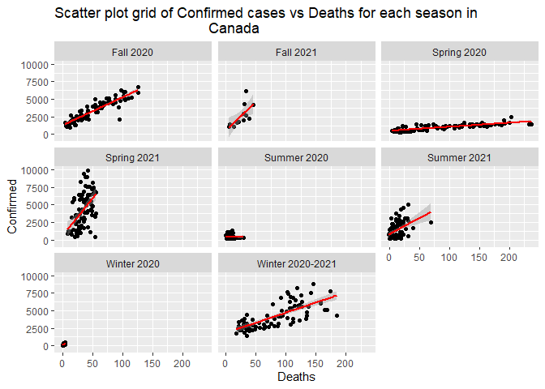
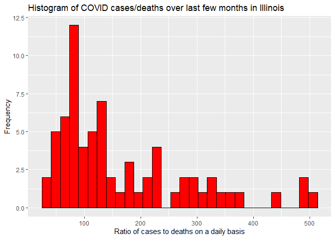

API Interaction: COVID-19
================
Brennan Clinch
10/4/2021
--
## Introduction

For this vignette, we want to give a tutorial on summarizing financial
data from an API. For starters, an API is a connection between computers
or between computer programs, which can also be called a software
interface. (“<https://en.wikipedia.org/wiki/API>”). API’s are an
important source for retrieving data and working with it, especially in
data science. We are interested in knowing how to first setup our API
for financial data and then how to interact with it and do data
analysis, etc. To do this, we need to know what is required in able to
be able to connect with our API (what packages are needed)

## Requirements

To be able to work with our API, we must first note that these following
packages were required.

\-`tidyverse: an R package for data science, with tons of tools for data visualization, manipulation, and analysis`

\-`jsonlite: this is one package used to read API files, which is basically a json parsor and generator`

`httr: another API package used which gives tools for working with urls and http`

## Functions used for contacting our API

To begin contacting our requested API, we need to first connect with it.
This can be done by going to the API and requesting a key and then
getting it to then connect with what section of our API we are
interested in.

Let’s start with my functions I used for connecting with my API.

`COVIDarea`

I wrote this simple function takes the `summary` endpoint and subset the
columns that we want returned for COVID data such as `Country`,
`NewRecovered`, `TotalRecovered`, `NewConfirmed`, `TotalConfirmed`, etc
in order to return a data frame that we are interested in for the
overall summary statistics for COVID-19 data for each country in the
world.

``` r
COVIDarea <- function(type = "all"){
  outputAPI <- GET("https://api.covid19api.com/summary")
  data <- fromJSON(rawToChar(outputAPI$content))
  output <- data$Countries
  if (type != "all"){
    output <- output %>% select(type) 
  }
  return(output)
}
```

`dayonestatus`

This is another simple function I made that takes in the `dayone`
endpoint and let’s me customize my endpoint I want to get a data frame
for data since the beginning of the COVID-19 pandemic for either
recovered or confirmed cases by typing in what I want in
parentheses(`confirmed` or `recovered` or `deaths`) after calling the
function. If I don’t type in anything it returns the whole data frame
with `confirmed`, `recovered`, and `deaths` for Canada

``` r
dayonestatus <- function(country = "all" ,type = "all"){
  if (type != "all" & type %in% c("recovered", "deaths", "confirmed")){
  baseurl <- "https://api.covid19api.com/dayone/country/"
  fullURL <- paste0(baseurl,country, "/status/", type)
  output <- fromJSON(fullURL)
  }
  else if (type == "all" & country != "all"){
    baseurl <- "https://api.covid19api.com/dayone/country/"
    fullURL <- paste0(baseurl,country)
    output <- fromJSON(fullURL)
  }
  else{
    stop("Error: Please specify area of interest for COVID.")
  }
  return(output)
}
```

`timeframe`

This is a helpful custom url function for the
`Live By Country And Status After Date` endpoint of the COVID API. It
let’s you pick the country (uses the slug (check `countrydic` function))
and then let’s you pick the dates you want the COVID data from for
confirmed cases.

``` r
timeframe <- function(country = "all", year = "all", date1 = "all", date2 = "all"){
  baseurl <- "https://api.covid19api.com/country/"
  countryurl <- country
  yearurl <- year
  date1url <- date1
  date2url <- date2
  fullurl <- paste0(baseurl,country,"/status/confirmed?from=",yearurl,"-",date1url,"T00:00:00Z&to=",yearurl,"-",date2url,"T00:00:00Z")
  output <- fromJSON(fullurl)
  if ( year != 2020:2021 | country != output$Slug ){
    stop("Error, please try again.")
  }
  return(output)
}
```

`Illinoistype`

This function interacts with the `USA` for the `live data`endpoint and
returns a data frame for COVID related data over the past several months
for the United States in Illinois after selecting what data you want
whether it be active cases, recovered, confirmed cases, or deaths.

``` r
Illinoistype <- function(type= "all", Province = "Illinois"){
  outputAPI <- GET("https://api.covid19api.com/live/country/USA")
  data <- fromJSON(rawToChar(outputAPI$content))
  if (Province != "all" & type != "all"){
    data <- data %>% select(Province,type) %>% filter(Province == "Illinois")
  }
  return(data)
}
```

`NorthAmerica` I made this simple function to interact with the `total`
endpoint and let you choose which country of North America you want a
data frame returned for COVID deaths, recovered, confirmed cases, and
active cases. It then returns a customized endpoint for `total` endpoint
url so you specify either united-states or canada and it returns a
dataframe for the total amount of the things mentioned above.

``` r
NorthAmerica <- function(type = "all", Country = "all"){
  outputAPI <- GET("https://api.covid19api.com/total/country/united-states")
  data <- fromJSON(rawToChar(outputAPI$content))
  if (type == c("Deaths", "Recovered", "Active", "Confirmed", "Date", "Country")){
     if (Country == "canada"){
       baseurl <- "https://api.covid19api.com/total/country/"
       fullURL <- paste0(baseurl, Country)
       data <- fromJSON(fullURL) 
       data <- data %>% select(type)
     }
     else if (Country == "united-states"){
      baseurl <- "https://api.covid19api.com/total/country/"
       fullURL <- paste0(baseurl, Country)
       data <- fromJSON(fullURL) 
       data <- data %>% select(type)
    }
  }
  else {
    stop("Error: please specify either united-states or canada or a valid type")
  }
  return(data)
}
```

`countrydic`

This function I created is a helper function that takes the `countries`
endpoint for COVID data and let’s you look up the `slug` of the Country
name you picked in capital letters from the `Country` column which gives
you reference for the `slug` and `ISO2` for some of the later functions
I created that let you customize the enpoint you want returned from the
COVID API. Also note I created a not in operator to be able to pass it
on in the else if statement without causing an error when parsing the
function with the purr package.

``` r
library(purrr)
`%not_in%` <- purrr::negate(`%in%`)

countrydic <- function(type = "all"){
 outputAPI <- fromJSON("https://api.covid19api.com/countries")
 if (type != "all"){
   if (type %in% outputAPI$Country){
      outputAPI <- outputAPI %>%
        filter(Country == type)
   }
   else if (type %not_in% outputAPI$Country){
     stop("Invalid entry")
   }
 }
 else {
   stop("Invalid entry")
 }
 return(outputAPI)
}
```

`COVIDapi`

This is my wrapper function used to call all of the functions that I
have made to easily reference them which is especially useful in my next
section which is my data analysis.

``` r
COVIDapi <- function(func, ...){
  if (func == "NorthAmerica"){
    output <- NorthAmerica(type = "Confirmed", Country = "canada")
  }
  else if (func == "COVIDarea"){
    output <- COVIDarea(...)
  }
  else if (func == "Illinoistype"){
    output <- Illinoistype(type = c("Confirmed", "Deaths"))
  }
  else if (func == "dayonestatus"){
    output <- dayonestatus(type = "all", country = "canada")
  }
  else if (func == "countrydic"){
    output <- countrydic(...)
  }
  else if (func == "timeframe"){
    output <- timeframe(...)
  }
  
  else {
    stop("ERROR: Argument for func is not valid!")
  }
  return(output)
}
```

\#\#Exploratory data analysis

Let’s first look at a numeric summary of our periodical data for each
season for Canada. Note that we must first convert the Total number of
cases to be individual cases each day. To do this, we need to use a for
loop to subtract the current day total case count from the one from the
previous day.

Let’s first create an object called `CA` which queries our function from
the `Day One Total` endpoint for Canada. To be able to do data analysis
on this variable, I first did some data manipulation on this data frame
first. I created a new column called period which gives us the season of
when the confirmed cases of COVID-19 occurred. I also wanted to be able
to look at the statistics for the number of cases, so I had to convert
the sum of the number of cases as shown in the original `CA` data frame
to be the daily number of cases for each specified date. This does
however create one `NA` value since it doesn’t count the latest total
data, so this updated data frame contains values up till the date prior
to the current date.

``` r
Canada <- COVIDapi("dayonestatus")
Canada <- Canada %>% mutate(Period = case_when(Confirmed < 1449 ~  "Winter 2020",
   Confirmed %in% 1773:95240~  "Spring 2020",
   Confirmed %in% 95564:131294~ "Summer 2020",
   Confirmed %in% 132449:430591~"Fall 2020",
   Confirmed %in% 435801:796896~  "Winter 2020-2021",
   Confirmed %in% 801299:1186180~ "Spring 2021",
   Confirmed %in% 1186180:1309938~ "Summer 2021",
   Confirmed > 1309938~ "Fall 2021"
 ), Month = case_when(Active %in% 1:3~"Jan 2020",
   Confirmed %in% 4:21~ "Feb 2020",
   Confirmed %in% 22:8543~ "Mar 2020",
   Confirmed %in% 9760:51348~"Apr 2020",
   Confirmed %in% 51349:85464~"May 2020",
   Confirmed %in% 85465:97908~"Jun 2020",
   Confirmed %in% 98106:107441~"Jul 2020",
   Confirmed %in% 107442:116934~"Aug 2020",
   Confirmed %in% 116935:144661~"Sep 2020",
   Confirmed %in% 144662:210514~ "Oct 2020",
   Confirmed %in% 210515:324505~"Nov 2020",
   Confirmed %in% 324506:486975~"Dec 2020",
   Confirmed %in% 486976:659501~"Jan 2021",
   Confirmed %in% 659502:737713~"Feb 2021",
   Confirmed %in% 737714:841135~"Mar 2021",
   Confirmed %in% 841136:1038545~"Apr 2021",
   Confirmed %in% 1038546:1162279~"May 2021",
   Confirmed %in% 1162280:1191157~"Jun 2021",
   Confirmed %in% 1191157:1204136~"Jul 2021",
   Confirmed %in% 1204136:1254136~"Aug 2021",
   Confirmed > 1254136~"Sep 2021"))
for (i in 1:max(row_number(Canada$Confirmed))){
  Canada$Confirmed[i] <- Canada$Confirmed[i+1]-Canada$Confirmed[i]
}
for (i in 1:max(row_number(Canada$Deaths))){
  Canada$Deaths[i] <- Canada$Deaths[i+1]-Canada$Deaths[i]
}
for (i in 1:max(row_number(Canada$Active))){
  Canada$Active[i]<- Canada$Active[i+1]-Canada$Active[i]
}
Canada <- na.omit(Canada)
```

Since I just got my data frame `CA` set up, I will now proceed with my
data exploration on my `CA` data for Canada. The first thing I looked at
was the overall distribution of the cases since the pandemic began by
creating a boxplot for the number of cases. I used the `ggplot2` package
for creating the boxplot.

``` r
library(ggplot2)
g <- ggplot(data = Canada, aes(x = Confirmed))
g+geom_boxplot()
```

<!-- -->

``` r
g <- ggplot(data = Canada, aes(x = Period, y = Confirmed))
g+geom_point(aes(col = Confirmed), position = "jitter", size = 1)+
  geom_boxplot(aes(col = Confirmed, alpha = 0.5))+
  theme(axis.text.x = element_text(angle = 45))+
  labs(title = "Boxplots for Covid cases in Canada for each season")
```

<!-- --> Based on the
2 boxplots, it is clearly shown that for the total distribution of
COVID-19 cases in Canada, it is noted that the distribution of cases
over the whole pandemic is skewed a little to the right with some
outlying daily cases over 7500 and close to 10000. For the 2nd plot with
the side-by-side boxplots for each season, we can see that Canada got
the most cases of COVID-19 during the spring of 2021 and the
distribution was roughly symmetric. It also shows that winter of 2020
had the lowest number of cases since it was the beginning of the
pandemic along with summer of 2020.

The next thing I did for the `CA` dataset was look at the general
summary statistics for each period throughout the pandemic. From the
summary statistics, it is correct that Spring 2021 had the highest
number of cases on average with spring of 2021 having the highest spread
of cases since it’s standard deviation was so high.

``` r
summary <- Canada  %>% group_by(Period) %>% summarise("Min." = min(Confirmed), "1st Quartile" = quantile(Confirmed,0.25,na.rm = TRUE), "Mean" =mean(Confirmed), "Median" = median(Confirmed), "3rd Quartile"= quantile(Confirmed,0.75,na.rm=TRUE), "Max." = max(Confirmed), "standard deviation." = sd(Confirmed))
summary
```

Another thing I did with the COVID data for the `CA` dataset was to look
at a contigency table for COVID cases by `less than 500`, `500-1000`,
`1000-2000`, `2000-3000`, `3000-4000`, `4000-6000`, and `6000+` to more
closely examine how many cases were of each of these range. So first I
added a new variable called `cases_range` that categorizes every COVID
case in each of these ranges.

``` r
Canada <- Canada %>%mutate(cases_range = case_when(Confirmed < 500~"less than 500",
      Confirmed %in% 500:1000 ~ "500-1000",
      Confirmed %in% 1001:2000~ "1000-2000",
      Confirmed %in% 2001:3000~ "2000-3000",
      Confirmed %in% 3001:4000~ "3000-4000",
      Confirmed %in% 4001:6000~ "4000-6000",
      Confirmed > 6000~ "6000+"))
knitr::kable(table(Canada$cases_range, Canada$Period))
```

|               | Fall 2020 | Fall 2021 | Spring 2020 | Spring 2021 | Summer 2020 | Summer 2021 | Winter 2020 | Winter 2020-2021 |
|:--------------|----------:|----------:|------------:|------------:|------------:|------------:|------------:|-----------------:|
| 1000-2000     |        16 |         5 |          50 |          14 |           5 |          19 |           0 |                3 |
| 2000-3000     |        25 |         4 |           2 |           5 |           0 |          18 |           0 |               31 |
| 3000-4000     |        19 |         0 |           0 |          15 |           0 |           5 |           0 |               20 |
| 4000-6000     |        26 |         2 |           0 |          24 |           0 |           3 |           0 |               21 |
| 500-1000      |         1 |         0 |          24 |           9 |          12 |          21 |           0 |                0 |
| 6000+         |         4 |         1 |           0 |          23 |           0 |           0 |           0 |               15 |
| less than 500 |         0 |         0 |          16 |           2 |          75 |          26 |          56 |                0 |

After creating the contigency table, I made bar plots to summarize the
contigency tables graphically.

``` r
bar <- ggplot(data = Canada, aes(x = cases_range))
bar+geom_bar(aes(fill = as.factor(Period)), position = "dodge", color = "black")+
  scale_x_discrete(labels = c("1000-2000", "2000-3000", "3000-4000", "4000-6000", "500-1000", "6000+", "less than 500"))+
  scale_fill_discrete(name = "Season/Period of pandemic", labels = c("Fall 2020", "Fall 2021", "Spring 2020", "Spring 2021", "Summer 2020", "Summer 2021", "Winter 2020", "Winter 2020-2021"))+
  theme(axis.text.x = element_text(angle = 30))
```

<!-- -->

I also created a contigency table and bar plot for the number of
confirmed cases in specific ranges by month during the pandemic for the
`Canada` data.

``` r
knitr::kable(table(Canada$Month,Canada$cases_range))
```

|          | 1000-2000 | 2000-3000 | 3000-4000 | 4000-6000 | 500-1000 | 6000+ | less than 500 |
|:---------|----------:|----------:|----------:|----------:|---------:|------:|--------------:|
| Apr 2020 |        27 |         2 |         0 |         0 |        1 |     0 |             0 |
| Apr 2021 |         0 |         0 |         3 |         7 |        0 |    20 |             0 |
| Aug 2020 |         0 |         0 |         0 |         0 |        2 |     0 |            29 |
| Aug 2021 |        14 |         8 |         3 |         0 |        5 |     0 |             1 |
| Dec 2020 |         0 |         1 |         2 |        22 |        0 |     6 |             0 |
| Feb 2020 |         0 |         0 |         0 |         0 |        0 |     0 |            30 |
| Feb 2021 |         3 |        15 |         9 |         1 |        0 |     0 |             0 |
| Jan 2020 |         0 |         0 |         0 |         0 |        0 |     0 |             5 |
| Jan 2021 |         0 |         0 |         5 |        14 |        0 |    12 |             0 |
| Jul 2020 |         0 |         0 |         0 |         0 |        1 |     0 |            30 |
| Jul 2021 |         0 |         0 |         0 |         0 |        9 |     0 |            22 |
| Jun 2020 |         0 |         0 |         0 |         0 |        6 |     0 |            24 |
| Jun 2021 |        10 |         0 |         0 |         0 |       15 |     0 |             5 |
| Mar 2020 |         3 |         0 |         0 |         0 |        6 |     0 |            22 |
| Mar 2021 |         0 |        15 |        10 |         5 |        0 |     1 |             0 |
| May 2020 |        20 |         0 |         0 |         0 |       11 |     0 |             0 |
| May 2021 |         4 |         5 |         7 |        13 |        0 |     2 |             0 |
| Nov 2020 |         0 |         3 |        17 |         9 |        0 |     1 |             0 |
| Oct 2020 |         8 |        21 |         1 |         0 |        1 |     0 |             0 |
| Sep 2020 |        13 |         1 |         0 |         0 |        9 |     0 |             7 |
| Sep 2021 |        10 |        14 |         2 |         5 |        1 |     1 |             0 |

``` r
bar2 <- ggplot(data = Canada, aes(x = cases_range))
bar2+geom_bar(aes(fill=as.factor(Month)), position = "dodge", color = "black")+
  scale_x_discrete(labels = c("1000-2000", "2000-3000","3000-4000","4000-6000","500-1000","6000+","less than 500"))+
scale_fill_discrete(name = "Month")+
theme(axis.text.x = element_text(angle = 30))+
  labs(title = "Bar plot of range of COVID cases by month", x = "Month")
```

<!-- -->

From the contigency table, the month that got the highest number of
daily cases on average was April 2021, likewise the months that got the
lowest number of daily cases less than 500 were July and February of
2020.

I created a summary table for the 5-number summary for each month with
regards to confirmed cases for Canada.

``` r
monthlysummary <- Canada  %>% group_by(Month) %>% summarise("Min." = min(Confirmed), "1st Quartile" = quantile(Confirmed,0.25,na.rm = TRUE), "Mean" =mean(Confirmed), "Median" = median(Confirmed), "3rd Quartile"= quantile(Confirmed,0.75,na.rm=TRUE), "Max." = max(Confirmed), "standard deviation." = sd(Confirmed))
monthlysummary
```

Let’s now look at the relationship between cases and deaths for the
state of Illinois in the United States. Let’s convert the total cases
and deaths to cases for each row (by date). We also deleted the last row
of data since we didn’t know the number of cases for the first record
since it only gave us the total number of cases overall. I also made a
loop converting the overall total number of deaths to daily number of
deaths using the same idea as before with the confirmed cases.

``` r
Illinoisdata <- COVIDapi("Illinoistype")
```

    ## Note: Using an external vector in selections is ambiguous.
    ## i Use `all_of(type)` instead of `type` to silence this message.
    ## i See <https://tidyselect.r-lib.org/reference/faq-external-vector.html>.
    ## This message is displayed once per session.

``` r
Illinoisdata <- Illinoisdata %>% mutate(Totalcases = Confirmed)

 for (i in min(row_number(Illinoisdata$Confirmed)):max(row_number(Illinoisdata$Confirmed))){
  Illinoisdata$Confirmed[i] <- Illinoisdata$Confirmed[i+1]-Illinoisdata$Confirmed[i]
 }

#Create loop that makes recreates the total number of cases to be able to create the new variable caseratio

for (i in min(row_number(Illinoisdata$Totalcases)):max(row_number(Illinoisdata$Totalcases))){
   Illinoisdata$Totalcases[i] <- Illinoisdata$Totalcases[i+1]
}

  for (i in min(row_number(Illinoisdata$Deaths)):max(row_number(Illinoisdata$Deaths))){
    Illinoisdata$Deaths[i] <- Illinoisdata$Deaths[i+1]-Illinoisdata$Deaths[i]
  }
Illinoisdata <- na.omit(Illinoisdata)

#create new variable that is the ratio of daily cases to total cases
Illinoisdata <- Illinoisdata %>% mutate(casedeathratio = (Confirmed/Deaths))
```

I now will create a scatter plot for `Illinoisdata` to show what the
relationship is between the number of cases and the number of deaths is
for COVID-19 in Illinois over the past few months. We will need the
`ggplot2` package from `tidyverse` here.

``` r
library(ggplot2)

g <- ggplot(data = Illinoisdata, aes(x = Deaths, y = Confirmed))
g+geom_point()+
  geom_smooth(method = "lm", color = "blue")+
  labs(title = "Daily Confirmed COVID Cases vs COVID Deaths in Illinois")
```

    ## `geom_smooth()` using formula 'y ~ x'

<!-- --> 

From the
plot, it shows that there is a strong positive linear relationship
between COVID-19 cases and COVID-19 deaths in Illinois.

One other thing that I would like to look at a plot of is the same
relationship but for different periods of the year for the `Canada`
dataset to see if the same relationship is said for different seasons
during the pandemic for the country of Canada.

``` r
g2<- ggplot(data = Canada, aes(x = Deaths, y = Confirmed))+geom_point()+
  geom_smooth(method = "lm", color = "red")+
  facet_wrap(~Period)
g2
```

    ## `geom_smooth()` using formula 'y ~ x'

<!-- -->

We see here that there is a strong positive relationship between
confirmed COVID cases and deaths during almost every season of the
pandemic except for the summer of 2020 where the relationship is close
to zero. Spring 2021 has the largest slope.

Another thing that was made in the data set `Illinoisdata` was the
variable `caseratio` which is the ratio of daily cases in Illinois over
the past few months to the total number of cases over the past few
months.

I constructed a histogram of the values. Note that these are all
percents.

``` r
hist <- ggplot(data = Illinoisdata, aes(x = casedeathratio))
hist+ geom_histogram( stat = "bin", fill = "Red", color = "black", binwidth = 0.3)+
  labs(x = "Ratio of cases to total cases over last few months(%)", title = "Histogram of COVID cases to total cases over last few months in Illinois",y = "Frequency")
```

    ## Warning: Removed 33 rows containing non-finite values (stat_bin).

<!-- --> 

From the
histogram, we can see that Illinois did have a large amount of days over
the past few months with a very small case ratio to total cases over the
past few months but also had a few outlying days with a large ratio
along with the fact that the data is highly skewed right and appears
exponential.

