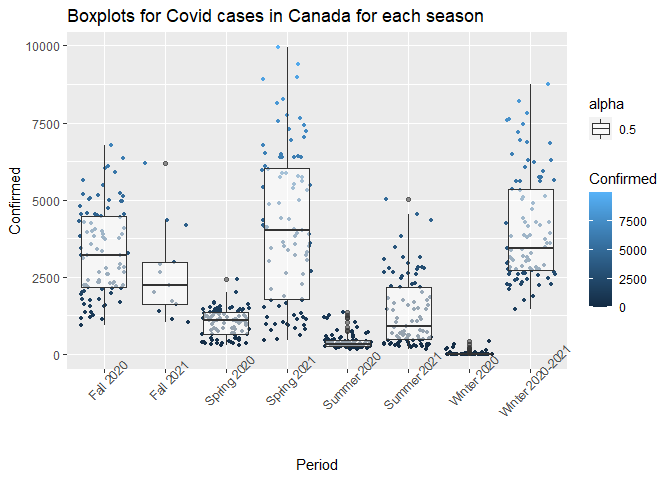
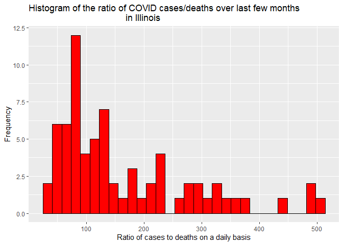

API Interaction: COVID-19
================
Brennan Clinch
10/4/2021

## Introduction

For this vignette, we want to give a tutorial interacting with and
summarizing data on COVID-19 from an API. For starters, an API is a
connection between computers or between computer programs, which can
also be called a software interface.
(“<https://en.wikipedia.org/wiki/API>”). API’s are an important source
for retrieving data and working with it, especially in data science. We
are interested in knowing how to first setup our API for COVID-19
[data](%22https://covid19api.com/%22) and then how to interact with it
and do data analysis, etc. To do this, we need to know what is required
in able to connect with our API (what packages are needed).

## Requirements

To be able to work with our API, we must first note that these following
packages were required. Without these, we cannot contact our API or be
able to do data analysis with it.

\-`tidyverse: an R package for data science, with tons of tools for data visualization, manipulation, and analysis`

\-`jsonlite: this is one package used to read API files, which is basically a json parsor and generator`

\-`httr: another API package used which gives tools for working with urls and http`

\-`purrr: Functional programming tools`

## Functions used for contacting our API

To begin contacting our requested API, we need to first connect with it.
This can be done by going to the API and requesting a key and then
getting it to then connect with what section of our API we are
interested in. We can also do this by using the `fromJSON` function

Let’s start with my functions I used for connecting with my API.

`COVIDarea`

I wrote this simple function takes the `summary` endpoint and subset the
columns that we want returned for COVID data such as `Country`,
`NewRecovered`, `TotalRecovered`, `NewConfirmed`, `TotalConfirmed`,
`NewDeaths`, etc in order to return a data frame that we are interested
in for the overall summary statistics for COVID-19 data for each country
in the world. Note this function is case-sensitive so you must enter a
type value for the string with one of the options above.

``` r
COVIDarea <- function(type = "all"){
  #Get data from summary endpoint
  outputAPI <- GET("https://api.covid19api.com/summary")
  data <- fromJSON(rawToChar(outputAPI$content))
  output <- data$Countries
  #subset columns based on what you enter for type
  if (type != "all"){
    output <- output %>% select(type) 
  }
  #Do nothing and enter the entire dataset from summary endpoint
  else {
    
  }
  return(output)
}
```

`dayonestatus`

This is another simple function I made that takes in the `dayone`
endpoint and let’s me customize my endpoint I want to get a data frame
for since the beginning of the COVID-19 pandemic for either recovered,
deaths, or confirmed cases by typing in what I want in
parentheses(`confirmed` or `recovered` or `deaths`) after calling the
function. If I don’t type in anything it returns the whole data frame
with `confirmed`, `recovered`, and `deaths` for Canada. `type` and
`country` are both non-case sensitive so either uppercase or lowercase
works fine.

``` r
dayonestatus <- function(country = "all" ,type = "all"){
  #modify the dayone endpoint through what is entered for type and country if type is equal to "recovered", "deaths", or "confirmed" and return data for the custom endpoint created from dayone.
  if (type != "all" & type %in% c("recovered", "deaths", "confirmed")){
  baseurl <- "https://api.covid19api.com/dayone/country/"
  fullURL <- paste0(baseurl,country, "/status/", type)
  output <- fromJSON(fullURL)
  }
  #modify the dayone endpoint if type is equal to all and country is not equal to all
  else if (type == "all" & country != "all"){
    baseurl <- "https://api.covid19api.com/dayone/country/"
    fullURL <- paste0(baseurl,country)
    output <- fromJSON(fullURL)
  }
  #return an error if neither conditions for if or else if are satisfied
  else{
    stop("Error: Please specify area of interest for COVID.")
  }
  #return our object which is output and change country and type to lowercase so it's not case-sensitive
  country <- tolower(country)
  type <- tolower(type)
  return(output)
}
```

`timeframe`

This is a helpful custom endpoint function for the
`Live By Country And Status After Date` endpoint of the COVID API that I
created. It let’s you pick the country (uses the slug (check
`countrydic` function)) and then let’s you pick the dates you want the
COVID data from for confirmed cases. If the year is not 2020 or 2021 the
function returns an error, if the country is not specified, the function
also returns an error, but if the dates are not in the correct format of
“MM-DD” it just returns the whole data set for the whole pandemic for
the specified country. Also noted here is that country is not
case-sensitive as long as you use the slug format (i.e. for countries
with more than one word use a “-” for separation).

``` r
timeframe <- function(country = "all", year = "all", date1 = "all", date2 = "all"){
  #Return an error if the year is not 2020 or 2021.
  if ( year != 2020:2021){
    stop("Error, please try again.")
  }
  #Return an error if country is not changed or selected
  else if (country == "all"){
    stop("Error, please try again")
  }
  #modify the country endpoint to 'Live By Country And Status After Date' endpoint based on what is entered for year, country, date1, and date2
  baseurl <- "https://api.covid19api.com/country/"
  countryurl <- country
  yearurl <- year
  date1url <- date1
  date2url <- date2
  fullurl <- paste0(baseurl,country,"/status/confirmed?from=",yearurl,"-",date1url,"T00:00:00Z&to=",yearurl,"-",date2url,"T00:00:00Z")
  output <- fromJSON(fullurl)
  #change what is entered for country to lowercase for non-case sensitivity and return the output endpoint dataset
  country <- tolower(country)
  return(output)
}
```

`USlive`

This function interacts with the `USA` for the `live data`endpoint and
returns a data frame for COVID related data over the past several months
for the United States in our state of interest after selecting what data
you want(need to choose which ones you want instead of setting type =
“all”) whether it be active cases, recovered, confirmed cases, or
deaths. It is not case sensitive with the first letter. If you enter an
invalid province or type or do nothing, it returns the entire data set
for all of the United States.

``` r
 USlive <- function(type= "all", province = "all"){
   #Return data from the "live data" endpoint
   data <- fromJSON("https://api.covid19api.com/live/country/USA")
   #Capitalize the first letter of province entered
   province <- str_to_title(province)
   #Subset Province(State of US) entered and columns you want(type) if type and province are changed
   if ( type != "all" & province != "all"){
     if (province %in% data$Province){
     data <- data %>% select(Province,type) %>% filter(Province == province)
     }
   }
   #do nothing if type and province are unchanged when calling function
   else {
   }
   return(data)
 }
```

`countrydic`

This function I created is a helper function that takes the `countries`
endpoint for COVID data and let’s you look up the `slug` of the Country
name you picked in capital letters from the `Country` column which gives
you reference for the `slug` and `ISO2` for some of the later functions
I created that let you customize the enpoint you want returned from the
COVID API. Also note I created a not in operator to be able to pass it
on in the else if statement without causing an error when parsing the
function with the purr package. It is not case sensitive so as long as
you spell the country correctly it will still return the correct result,
however for countries with more than one word with them you need to
include “-” in it since it returns rows based on the Slug.

``` r
#I created this function to be a conditional function to do the reverse of %in%. This is only here to be able to give us an error if the type is not in the country column of the data.
library(purrr)
`%not_in%` <- purrr::negate(`%in%`)

countrydic <- function(type = "all"){
  #Read in and output dataset from countries endpoint
 outputAPI <- fromJSON("https://api.covid19api.com/countries")
 #change string entered for type to all lowercase
 type = tolower(type)
 #subset rows based on type entered which is the slug of the country if type is not equal to all and if it is in the slug column.
 if (type != "all"){
   if (type %in% outputAPI$Slug){
      outputAPI <- outputAPI %>%
        filter(Slug == type) 
   }
   #return an error if not in Country column(really just put in %not_in% object to be able to give an error using the stop function)
   else if (type %not_in% outputAPI$Country){
     stop("Invalid entry")
   }
 }
 #Return an error otherwise
 else {
   stop("Invalid entry")
 }
 #output the modified dataset
 return(outputAPI)
}
```

`Totallib`

I wrote this helper function to take in the name of the country you want
from the `total` endpoint of the data along with what column (or group
of columns) you want and it returns the overall total value for things
such as Deaths, Confirmed Cases, Recovered, and Active cases which is a
helpful function to reference the overall totals for each country.

``` r
Totallib <- function(country = "all", type = "all"){
  #Take in the total endpoint and customize it based on what is entered for the country and type(column of interest from API)
  if (country != "all" & type != "all"){
  baseurl <- "https://api.covid19api.com/total/country/"
  fullURL <- paste0(baseurl, country)
  data <- fromJSON(fullURL) 
  data <- data %>% select(type)
  output <- tail(data,n=1)
  }
  #Do nothing if type is unchanged and country is changed
  else if (Country != "all" & type == "all"){
    
  }
  #return the output dataset
  return(output)
  
}
```

`COVIDapi`

This is my wrapper function used to call all of the functions that I
have made to easily reference them which is especially useful in my next
section which is my data analysis.

``` r
COVIDapi <- function(func, ...){
  #Find and call appropriate functions used with conditional logic
  if (func == "COVIDarea"){
    output <- COVIDarea(...)
  }
  else if (func == "dayonestatus"){
    output <- dayonestatus(country = "canada")
  }
  else if (func == "timeframe"){
    output <- timeframe(...)
  }
  else if (func == "USlive"){
    output <- USlive(type = c("Confirmed","Deaths"), province = "Illinois")
  }
  else if (func == "countrydic"){
    output <- countrydic(...)
  }
  else if (func == "Totallib"){
    output <- Totallib(..)
  }
  else {
    stop("ERROR: Argument for func is not valid!")
  }
  #return the functions you want
  return(output)
}
```

\#\#Exploratory data analysis

Now that we have functions that can interact with our COVID-19 API and
query what we want, let’s work with some of the functions we have
created and use them for data analysis.

Let’s first look at a numeric summary of our periodical data for each
season for Canada. Note that we must first convert the Total number of
cases to be individual cases each day. To do this, we need to use a for
loop to subtract the current day total case count from the one from the
previous day.

Let’s first create an object called `Canada` which queries our function
`dayonestatus` for Canada. To be able to do data analysis on this
variable, I first did some data manipulation on this data frame first. I
created a new column called period which gives us the season of when the
confirmed cases of COVID-19 occurred. I also wanted to be able to look
at the statistics for the number of cases, so I had to convert the sum
of the number of cases as shown in the original `Canada` data frame to
be the daily number of cases for each specified date. This does however
create one `NA` value since it doesn’t count the latest total data, so
this updated data frame contains values up till the date prior to the
current date.

``` r
#Create new dataframe called Canada which is equaled to the dayonestatus function with Canada being entered for the country
Canada <- COVIDapi("dayonestatus")
#add new column called Period which is the season of the pandemic based on the total number of confirmed cases from the start of the season to the end of the season, a new column called Month which is the month of the pandemic based on range of confirmed total cases overall for each month, along with a new column for the range area for the number of cases after using the loop shown later in this code chunk which is given after using the loop.
Canada <- Canada %>% mutate(Period = case_when(Confirmed < 1449 ~  "Winter 2020",
   Confirmed %in% 1773:95240~  "Spring 2020",
   Confirmed %in% 95564:131294~ "Summer 2020",
   Confirmed %in% 132449:430591~"Fall 2020",
   Confirmed %in% 435801:796896~  "Winter 2020-2021",
   Confirmed %in% 801299:1186180~ "Spring 2021",
   Confirmed %in% 1186180:1309938~ "Summer 2021",
   Confirmed > 1309938~ "Fall 2021"
 ), Month = case_when(Confirmed %in% 1:3~"Jan 2020",
   Confirmed %in% 4:21~ "Feb 2020",
   Confirmed %in% 22:8543~ "Mar 2020",
   Confirmed %in% 9760:51348~"Apr 2020",
   Confirmed %in% 51349:85464~"May 2020",
   Confirmed %in% 85465:97908~"Jun 2020",
   Confirmed %in% 98106:107441~"Jul 2020",
   Confirmed %in% 107442:116934~"Aug 2020",
   Confirmed %in% 116935:144661~"Sep 2020",
   Confirmed %in% 144662:210514~ "Oct 2020",
   Confirmed %in% 210515:324505~"Nov 2020",
   Confirmed %in% 324506:486975~"Dec 2020",
   Confirmed %in% 486976:659501~"Jan 2021",
   Confirmed %in% 659502:737713~"Feb 2021",
   Confirmed %in% 737714:841135~"Mar 2021",
   Confirmed %in% 841136:1038545~"Apr 2021",
   Confirmed %in% 1038546:1162279~"May 2021",
   Confirmed %in% 1162280:1191157~"Jun 2021",
   Confirmed %in% 1191157:1204136~"Jul 2021",
   Confirmed %in% 1204136:1254136~"Aug 2021",
   Confirmed > 1254136~"Sep 2021"))
#Create a loop that iterates through the number of confirmed cases and converts the overall total since the pandemic began to daily cases.
for (i in 1:619){
  Canada$Confirmed[i] <- Canada$Confirmed[i+1]-Canada$Confirmed[i]
}
#Create a loop that iterates through the number of deaths and converts the overall total number of deaths since the pandemic began to daily deaths
for (i in 1:619){
  Canada$Deaths[i] <- Canada$Deaths[i+1]-Canada$Deaths[i]
}
#Omit any null rows
Canada <- na.omit(Canada)
Canada <- Canada  %>% mutate(cases_range = case_when(Confirmed < 500~"less than 500",
   Confirmed %in% 500:1000 ~ "500-1000",
   Confirmed %in% 1001:2000~ "1000-2000",
   Confirmed %in% 2001:3000~ "2000-3000",
   Confirmed %in% 3001:4000~ "3000-4000",
   Confirmed %in% 4001:6000~ "4000-6000",
   Confirmed > 6000~ "6000+"))
```

Since I just got my data frame `Canada` set up, I will now proceed with
my data exploration on my `Canada` data. The first thing I looked at was
the overall distribution of the cases since the pandemic began by
creating a boxplot for the number of cases. I used the `ggplot2` package
for creating the boxplot which is in the `tidyverse` package.

``` r
#Create boxplot of the overall distribution of confirmed cases in Canada
g <- ggplot(data = Canada, aes(x = Confirmed))
g+geom_boxplot()+
  labs(title = "Boxplot of COVID cases for Canada of overall pandemic")
```

<!-- -->

``` r
#Create boxplot of the distribution of confirmed cases in Canada based on the Season of the Pandemic
g <- ggplot(data = Canada, aes(x = Period, y = Confirmed))
g+geom_point(aes(col = Confirmed), position = "jitter", size = 1)+
  geom_boxplot(aes(col = Confirmed, alpha = 0.5))+
  theme(axis.text.x = element_text(angle = 45))+
  labs(title = "Boxplots for Covid cases in Canada for each season")
```

<!-- --> Based on the
2 boxplots, it is clearly shown that for the total distribution of
COVID-19 cases in Canada, it is noted that the distribution of cases
over the whole pandemic is skewed a little to the right with some
outlying daily cases over 7500 and close to 10000. For the 2nd plot with
the side-by-side boxplots for each season, we can see that Canada got
the most cases of COVID-19 during the spring of 2021 and the
distribution was roughly symmetric. It also shows that winter of 2020
had the lowest number of cases since it was the beginning of the
pandemic along with summer of 2020.

The next thing I did for the `Canada` dataset was look at the general
summary statistics for each period throughout the pandemic. From the
summary statistics, it is correct that Spring 2021 had the highest
number of cases on average with spring of 2021 having the highest spread
of cases since it’s standard deviation was so high. Winter of 2020-2021
was a close runner up with regards to cases as well.

``` r
#Create summary statistic table for the Canada dataset based on confirmed cases grouped by season
Summary <- Canada  %>% group_by(Period) %>% summarize("Min"= min(Confirmed), "1st quartile"= quantile(Confirmed,0.25), "Mean" = mean(Confirmed), "Median"= median(Confirmed), "3rd quartile"= quantile(Confirmed,0.75), "Standard deviation"=sd(Confirmed))
knitr::kable(Summary, caption = paste("Summary statistics for confirmed COVID cases in Canada based on the season"))
```

| Period           |  Min | 1st quartile |       Mean | Median | 3rd quartile | Standard deviation |
|:-----------------|-----:|-------------:|-----------:|-------:|-------------:|-------------------:|
| Fall 2020        |  928 |      2178.00 | 3333.53846 | 3214.0 |      4480.50 |         1423.31790 |
| Fall 2021        | 1045 |      1612.00 | 2642.92308 | 2218.0 |      2964.00 |         1497.03382 |
| Spring 2020      |  274 |       656.50 | 1019.46739 | 1098.5 |      1341.75 |          436.83624 |
| Spring 2021      |  453 |      1774.75 | 4188.41304 | 4022.0 |      6016.25 |         2463.33907 |
| Summer 2020      |  156 |       256.75 |  400.92391 |  331.5 |       444.75 |          242.79898 |
| Summer 2021      |  151 |       466.25 | 1370.47826 |  890.5 |      2172.50 |         1136.13518 |
| Winter 2020      |    0 |         0.00 |   31.64286 |    1.0 |         8.75 |           82.41655 |
| Winter 2020-2021 | 1455 |      2724.00 | 4061.08889 | 3442.0 |      5333.00 |         1741.44517 |

Summary statistics for confirmed COVID cases in Canada based on the
season

Another thing I did with the COVID data for the `Canada` dataset was to
look at a contingency table for COVID cases by `less than 500`,
`500-1000`, `1000-2000`, `2000-3000`, `3000-4000`, `4000-6000`, and
`6000+` to more closely examine how many cases were of each of these
range. So first I added a new variable called `cases_range` that
categorizes every COVID case in each of these ranges.

``` r
#Create 2 way contingency table for cases_range variable and period variable (Category of confirmed cases and season)
knitr::kable(table(Canada$cases_range, Canada$Period), caption = paste("Contingency table for category of confirmed cases to the season of the pandemic"))
```

|               | Fall 2020 | Fall 2021 | Spring 2020 | Spring 2021 | Summer 2020 | Summer 2021 | Winter 2020 | Winter 2020-2021 |
|:--------------|----------:|----------:|------------:|------------:|------------:|------------:|------------:|-----------------:|
| 1000-2000     |        16 |         6 |          50 |          14 |           5 |          19 |           0 |                3 |
| 2000-3000     |        25 |         4 |           2 |           5 |           0 |          18 |           0 |               31 |
| 3000-4000     |        19 |         0 |           0 |          15 |           0 |           5 |           0 |               20 |
| 4000-6000     |        26 |         2 |           0 |          24 |           0 |           3 |           0 |               21 |
| 500-1000      |         1 |         0 |          24 |           9 |          12 |          21 |           0 |                0 |
| 6000+         |         4 |         1 |           0 |          23 |           0 |           0 |           0 |               15 |
| less than 500 |         0 |         0 |          16 |           2 |          75 |          26 |          56 |                0 |

Contingency table for category of confirmed cases to the season of the
pandemic

After creating the contingency table, I made bar plots to summarize the
contingency tables graphically.

``` r
#Create bar plot from results of previous contigency table
bar <- ggplot(data = Canada, aes(x = cases_range))
bar+geom_bar(aes(fill = as.factor(Period)), position = "dodge", color = "black")+
  scale_x_discrete(labels = c("1000-2000", "2000-3000", "3000-4000", "4000-6000", "500-1000", "6000+", "less than 500"))+
  scale_fill_discrete(name = "Season/Period of pandemic", labels = c("Fall 2020", "Fall 2021", "Spring 2020", "Spring 2021", "Summer 2020", "Summer 2021", "Winter 2020", "Winter 2020-2021"))+
  theme(axis.text.x = element_text(angle = 30))+
  labs(x = "Cases category", title = "Bar plot of Confirmed cases category based on season for Canada")
```

<!-- -->

I also created a contingency table and bar plot for the number of
confirmed cases in specific ranges by month during the pandemic for the
`Canada` data.

``` r
#Create contingency table and bar plot of COVID cases based on month and cases category
knitr::kable(table(Canada$Month,Canada$cases_range), caption = paste("contigency table for month of pandemic and category of covid cases in Canada"))
```

|          | 1000-2000 | 2000-3000 | 3000-4000 | 4000-6000 | 500-1000 | 6000+ | less than 500 |
|:---------|----------:|----------:|----------:|----------:|---------:|------:|--------------:|
| Apr 2020 |        27 |         2 |         0 |         0 |        1 |     0 |             0 |
| Apr 2021 |         0 |         0 |         3 |         7 |        0 |    20 |             0 |
| Aug 2020 |         0 |         0 |         0 |         0 |        2 |     0 |            29 |
| Aug 2021 |        14 |         8 |         3 |         0 |        5 |     0 |             1 |
| Dec 2020 |         0 |         1 |         2 |        22 |        0 |     6 |             0 |
| Feb 2020 |         0 |         0 |         0 |         0 |        0 |     0 |            30 |
| Feb 2021 |         3 |        15 |         9 |         1 |        0 |     0 |             0 |
| Jan 2020 |         0 |         0 |         0 |         0 |        0 |     0 |             5 |
| Jan 2021 |         0 |         0 |         5 |        14 |        0 |    12 |             0 |
| Jul 2020 |         0 |         0 |         0 |         0 |        1 |     0 |            30 |
| Jul 2021 |         0 |         0 |         0 |         0 |        9 |     0 |            22 |
| Jun 2020 |         0 |         0 |         0 |         0 |        6 |     0 |            24 |
| Jun 2021 |        10 |         0 |         0 |         0 |       15 |     0 |             5 |
| Mar 2020 |         3 |         0 |         0 |         0 |        6 |     0 |            22 |
| Mar 2021 |         0 |        15 |        10 |         5 |        0 |     1 |             0 |
| May 2020 |        20 |         0 |         0 |         0 |       11 |     0 |             0 |
| May 2021 |         4 |         5 |         7 |        13 |        0 |     2 |             0 |
| Nov 2020 |         0 |         3 |        17 |         9 |        0 |     1 |             0 |
| Oct 2020 |         8 |        21 |         1 |         0 |        1 |     0 |             0 |
| Sep 2020 |        13 |         1 |         0 |         0 |        9 |     0 |             7 |
| Sep 2021 |        11 |        14 |         2 |         5 |        1 |     1 |             0 |

contigency table for month of pandemic and category of covid cases in
Canada

``` r
bar2 <- ggplot(data = Canada, aes(x = cases_range))
bar2+geom_bar(aes(fill=as.factor(Month)), position = "dodge", color = "black")+
  scale_x_discrete(labels = c("1000-2000", "2000-3000","3000-4000","4000-6000","500-1000","6000+","less than 500"))+
scale_fill_discrete(name = "Month")+
theme(axis.text.x = element_text(angle = 30))+
  labs(title = "Bar plot of range of COVID cases by month for Canada", x = "Month")
```

<!-- -->

From the contingency table, the month that got the highest number of
daily cases on average was April 2021, likewise the months that got the
lowest number of daily cases less than 500 were July and February of
2020.

I created a summary table for the 5-number summary for each month with
regards to confirmed cases for Canada. April 2021 had the most cases on
average with January 2021 and December 2020 being close runner-ups.

``` r
#Create summary statistics for Canada cases grouped by month
monthlysummary <- Canada  %>% group_by(Month) %>% summarise("Min." = min(Confirmed), "1st Quartile" = quantile(Confirmed,0.25,na.rm = TRUE), "Mean" =mean(Confirmed), "Median" = median(Confirmed), "3rd Quartile"= quantile(Confirmed,0.75,na.rm=TRUE), "standard deviation" = sd(Confirmed))
knitr::kable(monthlysummary, caption = paste("Summary statistics for cases in Canada by month"))
```

| Month    | Min. | 1st Quartile |         Mean | Median | 3rd Quartile | standard deviation |
|:---------|-----:|-------------:|-------------:|-------:|-------------:|-------------------:|
| Apr 2020 |  977 |      1277.25 | 1440.0666667 | 1415.0 |      1485.25 |        268.3285343 |
| Apr 2021 | 3494 |      5894.00 | 6548.6666667 | 6397.0 |      7369.50 |       1484.5348124 |
| Aug 2020 |  156 |       229.50 |  310.9354839 |  260.0 |       381.00 |        110.0036168 |
| Aug 2021 |  215 |      1090.50 | 1686.4193548 | 1500.0 |      2220.50 |        863.1148542 |
| Dec 2020 | 2856 |      4513.50 | 5214.9032258 | 5038.0 |      5678.50 |       1076.0652816 |
| Feb 2020 |    0 |         0.00 |    0.7333333 |    0.0 |         1.00 |          1.4605935 |
| Feb 2021 | 1455 |      2368.00 | 2762.6428571 | 2747.0 |      3054.00 |        607.8782294 |
| Jan 2020 |    0 |         0.00 |    0.6000000 |    0.0 |         1.00 |          0.8944272 |
| Jan 2021 | 3127 |      4267.00 | 5581.9032258 | 5605.0 |      6390.00 |       1433.8383766 |
| Jul 2020 |  159 |       262.50 |  308.4193548 |  297.0 |       351.50 |         89.9647243 |
| Jul 2021 |  244 |       304.00 |  425.4193548 |  360.0 |       505.50 |        153.7850825 |
| Jun 2020 |  198 |       312.25 |  394.4666667 |  354.5 |       454.75 |        134.2993911 |
| Jun 2021 |  151 |       613.00 |  917.0666667 |  886.5 |      1122.50 |        437.3022259 |
| Mar 2020 |    3 |        12.00 |  314.0000000 |  137.0 |       520.00 |        381.4151719 |
| Mar 2021 | 2252 |      2586.50 | 3384.7741935 | 3149.0 |      3573.50 |       1231.2487891 |
| May 2020 |  665 |       906.50 | 1074.5161290 | 1101.0 |      1183.50 |        219.5115594 |
| May 2021 | 1264 |      2652.00 | 3913.5483871 | 3900.0 |      4937.00 |       1740.3841882 |
| Nov 2020 | 2402 |      3340.00 | 3870.8000000 | 3823.0 |      4259.00 |        776.8915692 |
| Oct 2020 |  928 |      1957.00 | 2147.5483871 | 2217.0 |      2366.50 |        509.5790314 |
| Sep 2020 |  368 |       519.50 |  967.6333333 |  826.5 |      1265.25 |        492.0626876 |
| Sep 2021 |  913 |      1755.25 | 2655.8823529 | 2651.5 |      2961.25 |       1214.0406554 |

Summary statistics for cases in Canada by month

One other thing that I would like to look at a plot of is the same
relationship but for different periods of the year for the `Canada`
dataset to see if the same relationship is said for different seasons
during the pandemic for the country of Canada.

``` r
#Create scatter plot grid of Confirmed cases vs Deaths for each season of COVID in Canada.
g2<- ggplot(data = Canada, aes(x = Deaths, y = Confirmed))+geom_point()+
  geom_smooth(method = "lm", color = "red")+
  facet_wrap(~Period)+
  labs(title = "Scatter plot grid of Confirmed cases vs Deaths for each season in 
                                 Canada")
g2
```

<!-- -->

We see here that there is a strong positive relationship between
confirmed COVID cases and deaths during almost every season of the
pandemic except for the summer of 2020 where the relationship is close
to zero. Spring 2021 has the largest slope.

I now wanted to look at the relationship between cases and deaths for
the state of Illinois in the United States with the data from the
`Illinoistype` function. Let’s convert the total cases and deaths to
cases for each row (by date). We also deleted the last row of data since
we didn’t know the number of cases for the first record since it only
gave us the total number of cases overall. I also made a loop converting
the overall total number of deaths to daily number of deaths using the
same idea as before with the confirmed cases along with adding new
variables caseratio(Cases to Deaths ratio) and deatharea(category of
deaths based on number)

``` r
#Read in USlive function with Illinois selected as the province and save it to data frame called "Illinoisdata"
Illinoisdata <- COVIDapi("USlive")

#Create loop that converts the total number of confirmed cases to the daily number of cases
 for (i in 1:103){
  Illinoisdata$Confirmed[i] <- Illinoisdata$Confirmed[i+1]-Illinoisdata$Confirmed[i]
 }

#Create loop that converts the total number of deaths to the daily number of deaths

  for (i in 1:103){
    Illinoisdata$Deaths[i] <- Illinoisdata$Deaths[i+1]-Illinoisdata$Deaths[i]
  }

#Remove any null values
Illinoisdata <- na.omit(Illinoisdata)

#create new variable that is the ratio of daily cases to total cases along with a variable that categorizes the amount of Deaths
Illinoisdata <- Illinoisdata %>% mutate(casedeathratio = (Confirmed/Deaths), deatharea = case_when(Deaths <5 ~"Low", 
                      Deaths %in% 5:30~"Average",
                      Deaths %in% 31:50~"Significant",
                      Deaths >50~ "High"))
```

I now will create a scatter plot for `Illinoisdata` to show what the
relationship is between the number of cases and the number of deaths is
for COVID-19 in Illinois over the past few months. We will need the
`ggplot2` package from `tidyverse` here.

``` r
#Create Scatter plot for Confirmed cases vs COVID deatha in Illinois.

g <- ggplot(data = Illinoisdata, aes(x = Deaths, y = Confirmed))
g+geom_point()+
  geom_smooth(method = "lm", color = "blue")+
  labs(title = "Daily Confirmed COVID Cases vs COVID Deaths in Illinois")
```

<!-- --> From the
plot, it shows that there is a strong positive linear relationship
between COVID-19 cases and COVID-19 deaths in Illinois. So the more
cases we had, the more deaths we had on average from COVID-19.

We see here that there is a strong positive relationship between
confirmed COVID cases and deaths during almost every season of the
pandemic except for the summer of 2020 where the relationship is close
to zero. Spring 2021 has the largest slope.

One other thing I did for `Illinoisdata` was create a one-way
contingency table for `deatharea`. We can see here most Deaths that
Illinois encountered over the past few months were only average (5 to 30
daily) but there were also a fair amount of days that were High as
well(greater than 50).

``` r
#Create one-way contingency table for the category of COVID deaths in Illinois
knitr::kable(table(Illinoisdata$deatharea), caption = paste("One way table of the category of COVID deaths in Illinois"))
```

| Var1        | Freq |
|:------------|-----:|
| Average     |   42 |
| High        |   11 |
| Low         |   36 |
| Significant |   13 |

One way table of the category of COVID deaths in Illinois

Another thing that was made in the data set `Illinoisdata` was the
variable `caseratio` which is the ratio of daily cases in Illinois over
the past few months to the total number of cases over the past few
months.

I constructed a histogram of the values.

``` r
#Create histogram of COVID cases to death ratio.
hist <- ggplot(data = Illinoisdata, aes(x = casedeathratio))
hist+ geom_histogram( stat = "bin", fill = "Red", color = "black")+
  labs(x = "Ratio of cases to deaths on a daily basis", title = "Histogram of COVID cases/deaths over last few months in Illinois",y = "Frequency")
```

<!-- --> From the
histogram, we can see that Illinois did have a large amount of days over
the past few months with a small case to death ratio but also had a few
days where the ratio was really high as noted here with some values
greater than 400.

## Conclusions

In summary from this vignette, I created functions that would interact
with endpoints from the COVID-19 API, return data I am interested in,
and then do data analysis on it using data visualization, summaries, and
tables. Most of the conclusions are not surprising as covid cases and
deaths are positively associated with one another but did not know that
in Canada this past spring was when the pandemic hit it’s worst point.

I hope that the examples I have given in this vignette give you an
important idea on ways you can communicate and work with API’s.
